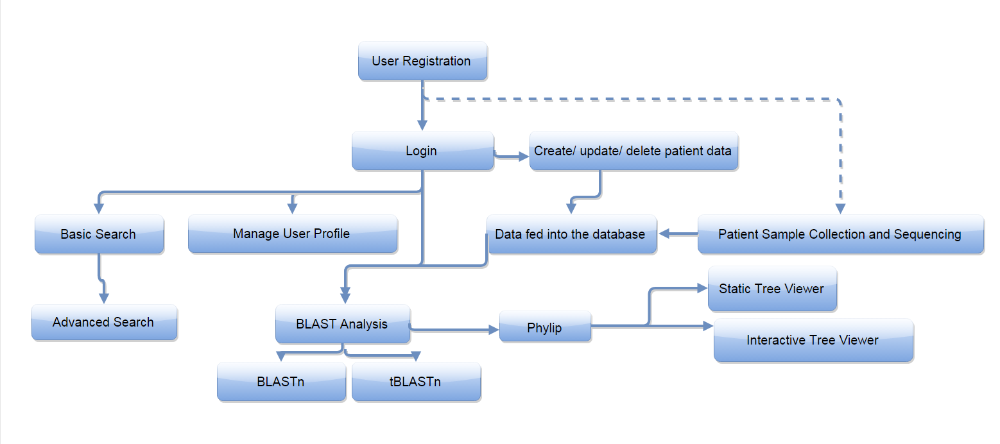

NOSOCOMIAL INFECTIONS SURVEILLANCE SYSTEM

Implementation of a web application that utilizes high-throughput genome sequencing data from The National Center of Biotechnology Information (NCBI). This would enable researchers, doctors and other health-care authorities to analyze a patient's next generation sequencing data to determine the closely related infectious agents, thereby providing valuable information to clinicians for administering the most effective treatment.

Procedural flowchart - 
The following flowchart depicts our web application's pipeline - 
image:  

[Click here to view our poster](http://cmpt470.csil.sfu.ca:8009/project/) 

Features of NISS include - 

Database - 
The database retrieves genomic sequence data from the NCBI website (ftp://ftp.ncbi.nlm.nih.gov/genomes/INFLUENZA/). The implementation of the database uses Django models to provide the main structure and relationships. The motivation to use models was to minimize the reliance on any one database type and to keep the influenza data agnostic to any particular production environment. 
Search functionality - The user is be able to search on many fields on the influenza data provided by NCBI. This includes searching by Genbank Accession Number, virus type, country and etc. The query is then processed by Djangos filters to produce the desired output. 
Matrix Visualization - Given a query on the dataset, the user is able to conduct data visualization on the query. By selecting the desired items for comparison, the user can produce an interactive chart depicting the relationships between the selected items. 
Technologies Used - Django models, JQuery, Datatables.js, Bootstrap, python, sqlite and D3.js. 

2) BLAST - 
BLAST (Basic Local Alignment Search Tool) is an algorithm for comparing primary biological sequence information, such as the amino-acid sequences of different proteins or the nucleotides of DNA sequences. A BLAST search enables a researcher to compare a query sequence with a library or database of sequences, and identify library sequences that resemble the query sequence above a certain threshold. The following two types of BLAST have been implemented in our system. 
a) Blastn - The blastn application searches a nucleotide query against a nucleotide database. Options include- 
I.E-value threshold - The Expect value (E) is a parameter that describes the number of hits one can "expect" to see by chance when searching a database of a particular size. It decreases exponentially as the Score (S) of the match increases. 
II.Word size - Length of initial exact match. Default size is 11.
III.Sensitivity - Either normal or distant.

b) tBlastn - It compares a protein query sequence against a nucleotide sequence database dynamically translated in all reading frames. Options include - 
I.Matrix  - Helps in evaluating the quality of a pairwise sequence alignment is the "substitution matrix", which assigns a score for aligning any possible pair of residues. The user can select from the following - BLOSUM 45, BLOSUM 62, BLOSUM 80, PAM 30, PAM 70.
II.E-value, Word size and sensitivity.

Blast results include the following - 
A table containing the contig hit, query, length of the obtained match, e-value, match-score , identity percentage.
A table of alignments between the hits and query listing high scoring pairs, length, e-value, score, query and subject start and end positions, number of identities, positives and bits.

Technologies used - 
NCBI command line blast+ 
Python and Django
JQuery
Biopython

3) PHYLIP - 
   Phylip is the phylogenetic tree generator app. Technologies/packages used are:
   (i) Biopython: for creating the server-side scripts that performs the multiple sequence alignment and phylogenetic tree generation. link- (http://biopython.org/wiki/Main_Page)
   (ii) Networkx: is a python package that is used for creation, and manipulation of networks, in this case it was used for phylogenetic tree generation and manipulation.link- (https://networkx.github.io/)
   (iii) Matplotlib: used for tree-plot creations. link- ( http://matplotlib.org/)
   (iv) Clustalw: the clustalw2 commandline tool was used on the server side, for performing phylogenetic analysis, this tool would be invoked when the user would click on the button in the template, that fetches the BLAST results file and runs the analyses.
 link- ( http://helixweb.nih.gov/multi-align/man/clustalw.1.html)
   (v) Pygraphwiz: used for graphical visualization. 
link- (https://pygraphviz.github.io/)
   (vi) Pydot: used in order to save the phylogenetic trees/ graphs
link- (https://pypi.python.org/pypi/pydot)
   (vii) PhyloCanvas: It is a JS library, uses no external libraries and is native to the browser.It uses the HTML5 canvas element. It has been used for enhancing the functionality of the tree visualization.
link- ( http://phylocanvas.org/)
    (viii) D3js visualisation: The D3js visualization was used for prettier representation of the phylogenetic trees generated. It also create interactive views. 
link- (http://d3js.org/)

4) Authentication - 
User profile -
(i) Used Django authentication system to handle user account, permissions and user registration. 
(ii) Create the database for user to store and update the basic information. The implementation was done using Django models to construct the data architecture and Django forms to interact with user. In addition to this, improving the user experiences was pondered upon by using Bootstrap and JQuery to deliver a user-friendly GUI. 
(iii) Give permission to users to create patient's profile in order to modify and manage patient's data. 
(iv) Patient profile and data - Using Django models to implement data structure for patients information. Implemented the features such as uploading and displaying data files in different formats. Also there are some cool features such as popup date selector which was achieved by using JQuery plugins. 

5) Cool features -  

(i)Interactive graphs - Display nosocomial infection statistics from public health agency of canada and Center of Disease and Control US in responsive bar chart and pie chart with highcharts, a javascript library. Implemented pop-up window with JPopup, a JQuery plugin  to demonstrate database data in a responsive graph using d3.js.
(ii)Tutorial and introductory video - Live tutorial to demonstrate main functions about our website. Animation video to explain the reason to create this website.
(iii)News feed -  Includes CDC Updates and medical news.
(iv)twitter - linked the NISS twitter account, enhancing the contact us media. JS was used to include the twitter account re-direct.
(v)Poster with zoom features - Implement full screen zoom and pane functionalities with javascript in displaying poster for easy read. 
(vi)Dashboard features - Provides a quick glance of the users current patients. Gives overview of their patients and quick visualization on the state of the virus database. 
(vii)Carousel template - Enhanced the feel and look factor, by including carousel templates, by having moving images, that do not strain the vision.
(vii)Bubble chart for symptoms of Nosocomial infections -  A very basic and simple overview of the symptoms for nosocomial infections. Implemented using d3js.
(viii)Informative static pages on nosocomial transmissions - These pages provide data from the previously published detailed reports of the disease control agency/ nosocomial infection monitoring body in Canada.
Contact form -  Provides visitors a convenient means to contact site administrators about inquiries or problems. 

6) REST API - 
The project uses the REST Djano API plugin to implement the RESTful features. 
To retrieve data, the user needs to be authenticated first. Then, once authenticated, the user can retrieve the serilaized database by appending api/nocoapi/ on to the URL containing their username. 
To query specific data entries, the user can append the Genbank Accession Number on the end of api/nocoapi/ to create api/nocoapi/EU521992/. This will retrieve the specific virus associated with the id. 

